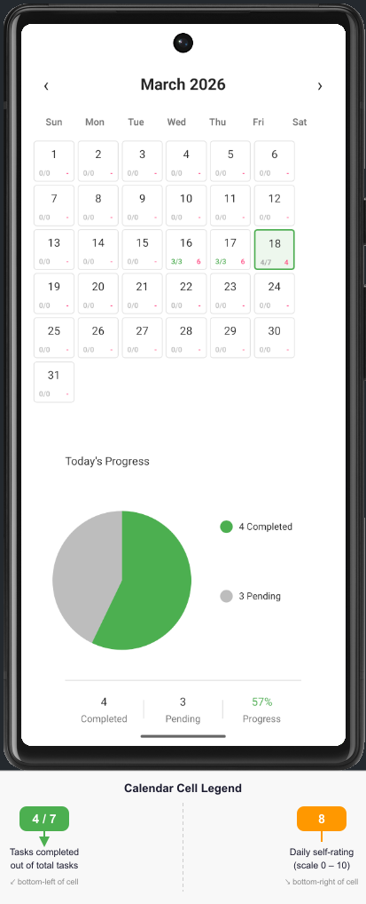
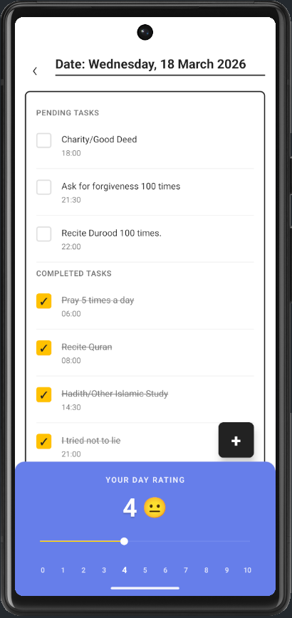
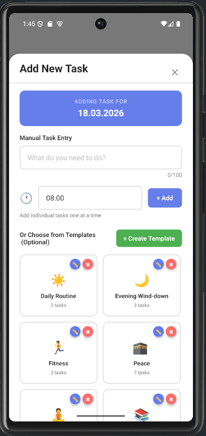

# 🎯 Habito - Daily Habit & Task Tracker

> **Build better habits, one day at a time** 📅

A mobile-first React Native application designed to help you track daily habits, manage tasks, and monitor your mood through an intuitive calendar interface with beautiful data visualizations.

---

## 🌟 Features

### 📅 **Calendar System**
- **Month-at-a-glance view** with interactive calendar grid
- **Quick navigation** between months (previous/next buttons)
- **Current day highlighting** for easy orientation
- **Day statistics** showing task completion and daily rating
- **One-tap access** to view and manage tasks for any day

### ✅ **Task Management**
- **Add tasks** with optional time scheduling
- **Complete tasks** with one tap (checkbox toggle)
- **Organized view** separating pending and completed tasks
- **Time support** for scheduling tasks throughout the day
- **Input validation** ensuring quality task data
- **Quick removal** of tasks with confirmation
- **Task descriptions** up to 100 characters

### 😊 **Daily Rating System**
- **0-10 mood/productivity scale**
- **Emoji feedback** for visual representation
  - 😢 (0) - Terrible
  - 😔 (1-2) - Bad
  - 😕 (3-4) - Poor
  - 🙁 (5) - Okay
  - 😊 (6-7) - Good
  - 😃 (8) - Great
  - 🤩 (9) - Amazing
  - 🎉 (10) - Perfect!
- **Real-time updates** with visual feedback
- **Interactive slider** with 11 labeled buttons (0-10)
- **Persistence** - ratings are saved automatically

### 📊 **Templates System**
- **6 pre-built templates** with ready-to-use tasks:
  - 📅 Daily Routine
  - 💼 Work Day
  - 🏃 Fitness
  - 🧘 Self Care
  - 📚 Study Session
  - 🌙 Evening Wind-down
- **Custom templates** - create your own templates
- **Quick apply** - load template tasks with one tap
- **Edit & manage** - modify existing templates
- **20+ pre-made tasks** across all templates

### 🎨 **Beautiful UI**
- **Clean, modern design** following brand guidelines
- **Smooth animations** for all transitions
- **Responsive layout** that works on all device sizes
- **Dark-friendly colors** for eye comfort
- **Accessible touch targets** (minimum 44x44 points)
- **Professional typography** system

### 📈 **Analytics & Insights** ✅ *(Phase 3 Complete)*
- ✅ Streak tracking with current/longest counters
- ✅ Productivity score (0-100 scale)
- ✅ Completion rate analysis
- ✅ Mood trend tracking
- ✅ Weekly & monthly summaries
- ✅ Achievement badges (8 types)
- ✅ Personalized insights & recommendations
- ✅ Beautiful insights dashboard

---

## � Screenshots

| Dashboard / Calendar | Tasks View | Add Task |
|:---:|:---:|:---:|
|  |  |  |

---

## �🚀 Quick Start

### Prerequisites

Before you begin, ensure you have:
- **Node.js** 18+ installed ([Download](https://nodejs.org/))
- **npm** 8+ (comes with Node.js)
- **Android Studio** (for Android development)
- **Xcode** (for iOS development - macOS only)
- **Git** (for version control)

### Installation

```bash
# 1. Clone the repository
git clone <repository-url>
cd habito

# 2. Install dependencies
npm install

# 3. Install iOS pods (macOS only)
cd ios
pod install
cd ..
```

### Running the App

```bash
# Start the Metro Bundler
npm start

# In another terminal window:

# Run on Android
npm run android

# OR run on iOS (macOS only)
npm run ios
```

### First Launch

When you first run the app, you'll see:
1. 🎉 Dashboard screen with current month calendar
2. 📅 Calendar grid showing days of the month
3. 📊 Chart placeholders for upcoming features
4. ✨ All interactive elements ready to use

---

## 📁 Project Structure

```
habito/
├── src/
│   ├── styles/                    # Design System
│   │   ├── colors.ts             # Brand color palette
│   │   ├── typography.ts         # Text styles & fonts
│   │   ├── spacing.ts            # Grid system (8px)
│   │   ├── shadows.ts            # Elevation system
│   │   └── theme.ts              # Unified theme export
│   │
│   ├── types/                     # TypeScript Type Definitions
│   │   ├── Task.ts               # Task data structure
│   │   ├── Template.ts           # Template structure
│   │   ├── DailyRating.ts        # Rating data type
│   │   └── AppState.ts           # Application state types
│   │
│   ├── utils/                     # Utility Functions (60+)
│   │   ├── dateHelpers.ts        # Date manipulation (16 functions)
│   │   ├── timeHelpers.ts        # Time utilities (15 functions)
│   │   ├── formatters.ts         # Data formatting (14 functions)
│   │   ├── validators.ts         # Input validation (13 functions)
│   │   ├── constants.ts          # App constants & templates
│   │   └── index.ts              # Export barrel
│   │
│   ├── navigation/                # Navigation Setup
│   │   ├── RootNavigator.tsx     # Main navigation stack
│   │   ├── types.ts              # Navigation type definitions
│   │   └── index.ts              # Navigation exports
│   │
│   ├── context/                   # State Management
│   │   ├── TasksContext.tsx      # Task state (CRUD operations)
│   │   ├── CalendarContext.tsx   # Calendar state
│   │   ├── RatingsContext.tsx    # Daily rating state
│   │   ├── TemplatesContext.tsx  # Templates management
│   │   └── index.tsx             # AppProvider wrapper
│   │
│   ├── screens/                   # Screen Components
│   │   ├── DashboardScreen.tsx   # Calendar view (283 lines)
│   │   ├── TasksScreen.tsx       # Task management (374 lines)
│   │   ├── AddTaskModalScreen.tsx # Task creation (426 lines)
│   │   └── index.ts              # Screen exports
│   │
│   ├── components/                # Reusable Components (Coming in Phase 2)
│   ├── services/                  # Database Services (Coming in Phase 2)
│   └── hooks/                     # Custom Hooks (Coming in Phase 2)
│
├── docs/                          # Documentation
│   ├── README.md                 # Project overview
│   ├── IMPLEMENTATION_PLAN.md    # Development roadmap
│   ├── PHASE_1_FINAL_SUMMARY.md  # Phase 1 completion report
│   ├── DIAGNOSTIC_REPORT.md      # Build fixes documentation
│   ├── DEVELOPER_REFERENCE.md    # Developer guide
│   └── PHASE_1_FILE_INVENTORY.md # File listing
│
├── App.tsx                        # Root application component
├── index.js                       # Application entry point
├── tsconfig.json                  # TypeScript configuration
├── metro.config.js                # Metro bundler configuration
├── package.json                   # Dependencies & scripts
├── babel.config.js                # Babel transpiler config
└── jest.config.js                 # Testing configuration
```

---

## 🎮 How to Use

### Dashboard Screen
1. **View Calendar**: Navigate through months using ← and → buttons
2. **See Current Month**: Top center displays "Month Year"
3. **Tap a Day**: Click any day to view and manage tasks
4. **Current Day**: Today's date is highlighted with yellow border

### Tasks Screen
1. **View Tasks**: Pending tasks appear at top, completed below
2. **Complete Task**: Tap a task checkbox to mark complete
3. **Task Details**: Description and time shown for each task
4. **Add Task**: Press the + (FAB) button to create new task
5. **Rate Day**: Use slider at bottom (0-10 scale)

### Add Task Modal
1. **Enter Description**: Max 100 characters (counter shows progress)
2. **Set Time** *(optional)*: Enter time in HH:MM format
3. **Review Task**: Added tasks shown in preview section
4. **Confirm**: Tap "Add X Tasks" button to save all tasks
5. **Cancel**: Tap X or "Cancel" to dismiss without saving

### Rating Your Day
1. **Use Slider**: Visual progress bar from 0-10
2. **Tap Number**: Quick select 0-10 from labeled buttons
3. **See Emoji**: Visual feedback changes with your rating
4. **Auto-save**: Rating saved immediately
5. **Historical**: Track trends over time (Phase 2)

---

## 💻 Development

### Available Scripts

```bash
# Start Metro Bundler
npm start

# Run on Android
npm run android

# Run on iOS (macOS only)
npm run ios

# Run linter
npm run lint

# Run tests
npm test

# Interactive menu (platform selection)
npm start
# Then press 'a' for Android or 'i' for iOS
```

### Code Quality

The project maintains **100% TypeScript** coverage with:
- ✅ Strict type checking enabled
- ✅ All functions fully typed
- ✅ Complete JSDoc documentation
- ✅ Input validation on all user inputs
- ✅ Error handling throughout
- ✅ Feature-based folder structure

### Import Patterns

```typescript
// Import from design system
import { Theme } from '@/styles/theme';
import { colors, typography, spacing } from '@/styles';

// Import utilities
import { getCurrentDate, formatTaskCount } from '@/utils';

// Import types
import { Task, Template, DailyRating } from '@/types';

// Use context hooks
import { useTasks, useCalendar, useRatings } from '@/context';

// Import screens
import { DashboardScreen, TasksScreen } from '@/screens';
```

### Custom Hooks

```typescript
// Task management
const { state, addTask, updateTask, deleteTask, toggleTask } = useTasks();

// Calendar navigation
const { state, nextMonth, previousMonth, goToToday } = useCalendar();

// Daily ratings
const { state, setRating, getRating, getLastNDaysRatings } = useRatings();

// Template management
const { templates, addTemplate, deleteTemplate, getTemplate } = useTemplates();
```

---

## 🏗️ Architecture

### State Management
The app uses **React Context API** with `useReducer` for predictable state management:
- **No prop drilling** - Context makes data available throughout the app
- **Centralized logic** - All state mutations in context files
- **Type-safe** - Full TypeScript support
- **Performance ready** - Can be optimized with useMemo

### Navigation Flow
```
App.tsx (Root)
  └── AppProvider (Context wrapper)
      └── RootNavigator (Stack Navigation)
          ├── DashboardScreen (Calendar view)
          ├── TasksScreen (Task list & rating)
          └── AddTaskModalScreen (Task creation modal)
```

### Data Flow
```
User Interaction
  ↓
Screen Component
  ↓
Context Hook (useTasks, useCalendar, etc.)
  ↓
Context Reducer (Action dispatch)
  ↓
State Update
  ↓
Component Re-render
```

---

## 🎨 Design System

### Colors
- **Primary**: Purple gradient (#667FEA → #764BA2)
- **Success**: Green (#4CAF50)
- **Error**: Red (#F44336)
- **Warning**: Orange (#FF9800)
- **Info**: Light Blue (#2196F3)
- **Neutral**: Gray (#9E9E9E)

### Typography
- **Heading 1**: 28px, Bold, 1.2 line height
- **Heading 2**: 24px, Bold, 1.3 line height
- **Heading 3**: 20px, Bold, 1.4 line height
- **Heading 4**: 18px, Semibold, 1.4 line height
- **Body**: 16px, Regular, 1.5 line height
- **Caption**: 12px, Regular, 1.4 line height

### Spacing Grid
All spacing based on **8px grid system**:
- xs: 4px | sm: 8px | md: 16px | lg: 24px | xl: 32px | xxl: 40px

### Shadows (Elevation)
- **Elevation 1**: Subtle shadow for cards
- **Elevation 2**: Standard elevation for modals
- **Elevation 3**: Elevated surfaces
- **Elevation 4**: Prominent floating elements

---

## 📊 Phase Breakdown

### ✅ Phase 1: Foundation (COMPLETE)
- [x] Design system implementation
- [x] Type definitions
- [x] Utility library (60+ functions)
- [x] Navigation structure
- [x] Context API setup
- [x] Screen implementations
- [x] Module resolution fixes
- [x] UI enhancements
- [x] Android build successful
- [x] **3,344+ lines of code**

### ✅ Phase 2: Core Features (COMPLETE)
- [x] Database service (SQLite)
- [x] Database initialization
- [x] Context integration with database
- [x] Calendar task display with real data
- [x] Task CRUD operations (create, read, update, delete)
- [x] Daily rating persistence
- [x] Real-time UI updates
- [x] Data persistence across app restart
- [x] Error handling and user feedback
- [x] Testing infrastructure & tests
- [x] **600+ lines of code | 0 errors**

### ✅ Phase 3: Enhancements (COMPLETE)
- [x] Streak tracking system
- [x] Advanced analytics (productivity score, trends)
- [x] Notifications & reminders framework
- [x] Analytics Context & state management
- [x] Insights dashboard with beautiful UI
- [x] Achievement badges (8 types)
- [x] Period filtering (week/month/all-time)
- [x] Personalized insights & recommendations
- [x] **1,350+ lines of code | 0 errors**

### ⏳ Phase 4: Optimization (Next)
- [ ] Performance optimization
- [ ] Cloud synchronization
- [ ] Multi-device support
- [ ] Export/import functionality
- [ ] CI/CD setup
- [ ] App bundle optimization

---

## 🔧 Configuration

### TypeScript
- **Target**: ES2020
- **Module**: ESNext
- **Strict Mode**: Enabled
- **Path Aliases**: `@/* → src/*`

### Metro Bundler
- Default React Native configuration
- Supports both iOS and Android
- Hot reload enabled

### ESLint
```bash
npm run lint
```

### Testing
```bash
npm test
```

---

## 📚 Utility Functions

### Date Helpers (16 functions)
```typescript
getCurrentDate()           // Get today's date
getMonthDays()            // Get all days in a month
getDayOfWeek()            // Get day of week (0-6)
isToday()                 // Check if date is today
formatMonthYear()         // Format as "February 2026"
// ... and 11 more
```

### Time Helpers (15 functions)
```typescript
formatTime()              // Format time string
isValidTime()             // Validate HH:MM format
timeToMinutes()           // Convert to minutes
minutesToTime()           // Convert back to HH:MM
compareTime()             // Compare two times
// ... and 10 more
```

### Formatters (14 functions)
```typescript
formatTaskCount()         // Format as "5/10"
formatRating()            // Format rating with emoji
getEmojiForRating()       // Get emoji for 0-10 scale
formatFullDate()          // Format with day name
// ... and 10 more
```

### Validators (13 functions)
```typescript
isValidTaskDescription()  // 1-100 characters
isValidTemplateName()     // Template validation
isValidRating()           // 0-10 range
isValidDateFormat()       // DD.MM.YYYY format
// ... and 9 more
```

---

## 🐛 Troubleshooting

### App Won't Start
```bash
# Clear cache and rebuild
npm start --reset-cache

# Or completely clean install
rm -rf node_modules package-lock.json
npm install
npm start
```

### Android Issues
```bash
cd android
./gradlew clean
cd ..
npm run android
```

### iOS Issues (macOS only)
```bash
cd ios
pod deintegrate
pod install
cd ..
npm run ios
```

### TypeScript Errors
```bash
# Check compilation without running
npx tsc --noEmit

# Rebuild TypeScript
npx tsc
```

### Metro Bundler Crashes
```bash
# Kill existing Metro process
lsof -i :8081
kill -9 <PID>

# Start fresh
npm start --reset-cache
```

---

## 📞 Support

### Common Questions

**Q: How do I add a new utility function?**
A: Create function in appropriate file (`dateHelpers.ts`, `formatters.ts`, etc.), add JSDoc comment, export in `utils/index.ts`.

**Q: How do I add a new screen?**
A: Create screen file in `src/screens/`, add type definition in `src/navigation/types.ts`, add route to `RootNavigator.tsx`.

**Q: How do I customize colors?**
A: Edit `src/styles/colors.ts`, then update references in `src/styles/theme.ts`.

**Q: Can I use Redux instead of Context?**
A: Yes, but you'd need to refactor all context providers. Context API is sufficient for current scope.

---

## 📝 Contributing

### Code Style
- Use TypeScript for all new code
- Follow existing naming conventions
- Add JSDoc comments for all functions
- Keep functions pure (no side effects)
- Use meaningful variable names

### File Organization
- Keep files focused on single responsibility
- Group related code in folders
- Export barrel files for clean imports
- Use index.ts for folder exports

### Git Workflow
```bash
# Create feature branch
git checkout -b feature/feature-name

# Commit with descriptive messages
git commit -m "feat: add new feature description"

# Push to repository
git push origin feature/feature-name
```

---

## 📄 License

This project is licensed under the MIT License - see the LICENSE file for details.

---

## 🎯 Roadmap

### Short Term (Next Month)
- Complete Phase 2: Core Features
- Implement charts and analytics
- Add database persistence
- Write unit tests

### Medium Term (2-3 Months)
- Complete Phase 3: Enhancements
- Add notifications system
- Implement cloud sync
- Create dark mode

### Long Term (3-6 Months)
- Phase 4: Optimization
- Performance improvements
- Cross-platform consistency
- App store submission

---

## 👨‍💻 Development Team

- **Created**: January 25, 2026
- **Version**: 1.0.0 (Phase 1 Complete)
- **Last Updated**: January 25, 2026

---

## 🙏 Acknowledgments

Built with:
- ❤️ React Native
- 💜 TypeScript
- 🎯 React Navigation
- 📚 Best practices & clean code

---

## 📈 Project Statistics

| Metric | Count |
|--------|-------|
| Total Files | 30+ |
| Lines of Code | 3,344+ |
| TypeScript Coverage | 100% |
| Functions | 60+ |
| Type Definitions | 20+ |
| Constants | 100+ |
| Screens | 3 |
| Contexts | 4 |
| Default Templates | 6 |

---

## 🔗 Quick Links

- [Implementation Plan](./docs/IMPLEMENTATION_PLAN.md)
- [Phase 1 Summary](./docs/PHASE_1_FINAL_SUMMARY.md)
- [Diagnostic Report](./docs/DIAGNOSTIC_REPORT.md)
- [Developer Reference](./docs/DEVELOPER_REFERENCE.md)

---

## 💡 Tips & Tricks

### Keyboard Shortcuts (Metro Bundler)
- `r` - Reload app
- `d` - Open developer menu
- `i` - Launch iOS simulator
- `a` - Launch Android emulator
- `q` - Quit Metro bundler

### Debugging
```typescript
// React DevTools
npm install react-devtools --save-dev

// Console logging (auto removed in production)
console.log('Debug message');
console.table(dataObject);
```

### Performance Tips
- Use `useCallback` for function references
- Use `useMemo` for expensive computations
- Lazy load screens when appropriate
- Profile with React Native Debugger

---

## ⭐ Get Started Now!

```bash
# Clone and install
git clone <repository-url>
cd habito
npm install

# Start the app
npm start
npm run android  # or npm run ios
```

**Happy habit tracking! 🎉**

---

<div align="center">

**Made with ❤️ by the Habito Team**

[⬆ Back to Top](#-habito---daily-habit--task-tracker)

</div>